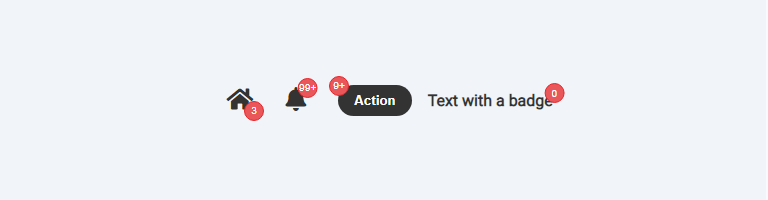
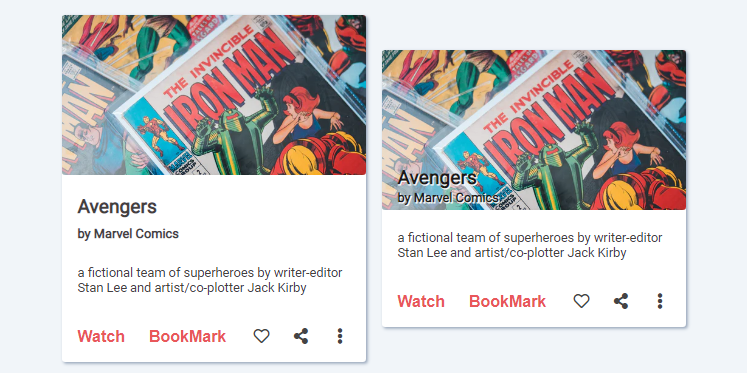
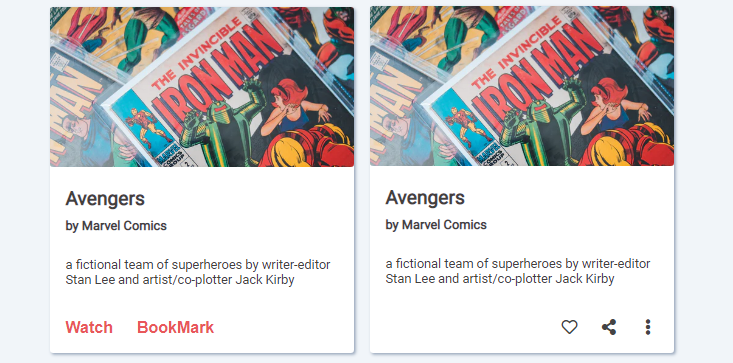
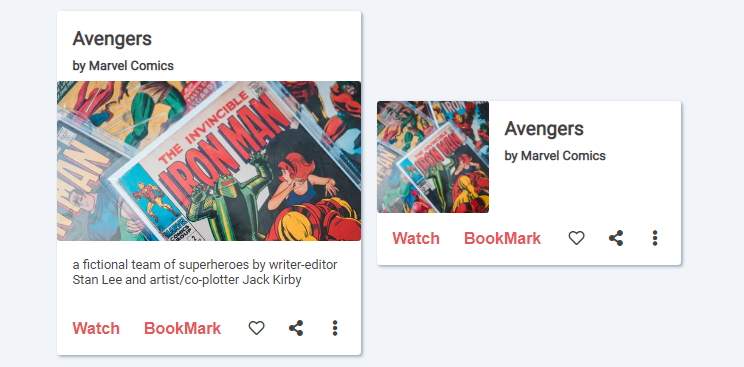
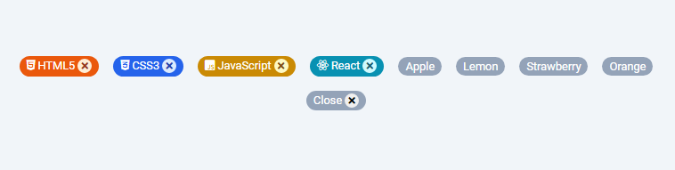
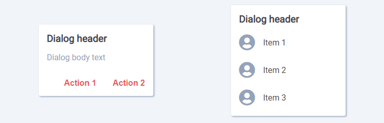
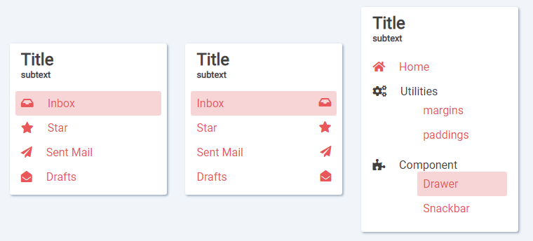
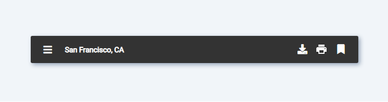
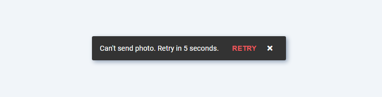
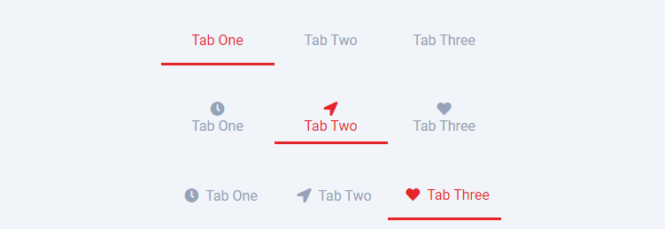

## Week Two Assignment

### components built using HTML5 and CSS3 only

Built to practice Flex-box and Positioning exercise, [neogCamp](https://neog.camp/)

#### You will find these components in this project

- [Badge](#badge)
- [Cards](#cards)
- [Chips](#chips)
- [Dialog](#dialog)
- [Drawer](#drawer)
- [Header](#header)
- [Snackbar](#snackbar)
- [Tabs](#tabs)

---

UI of the components

### Badge

### Cards

### Chips

### Dialog

### Drawer

### Header

### Snackbar

### Tabs

